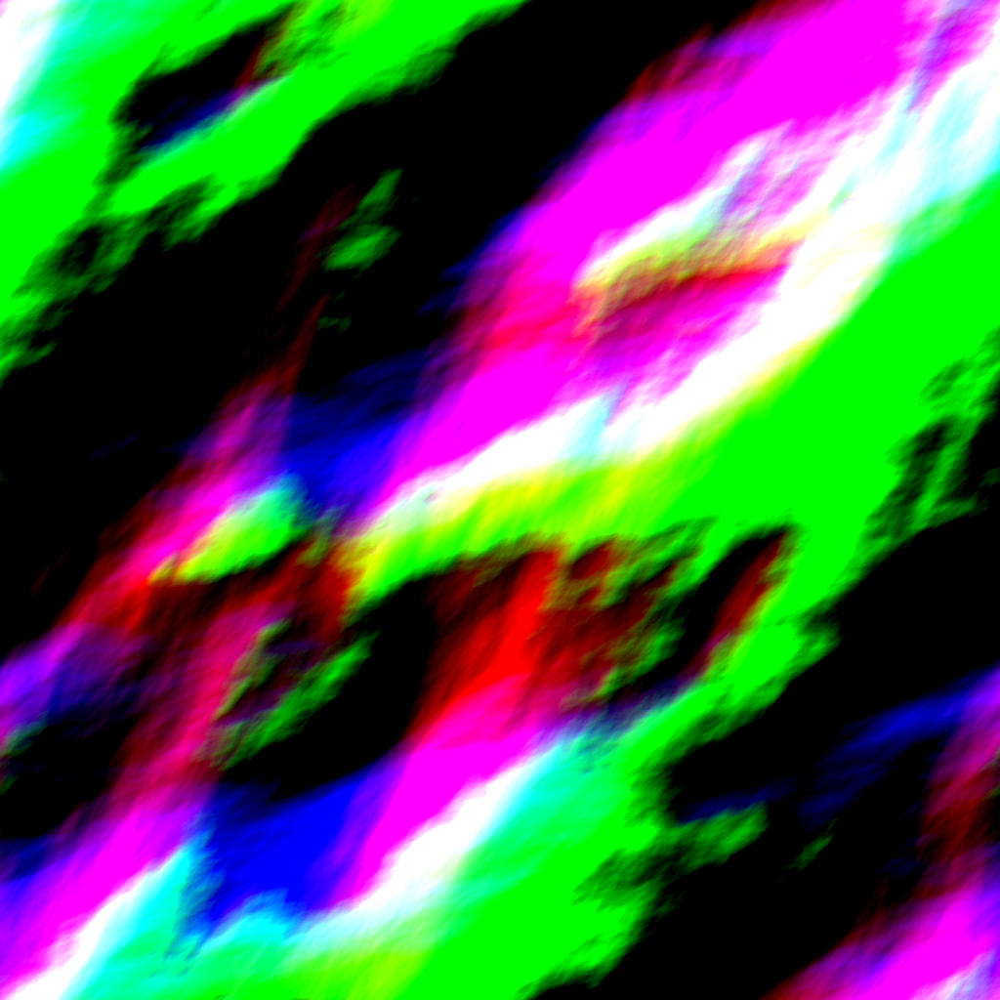
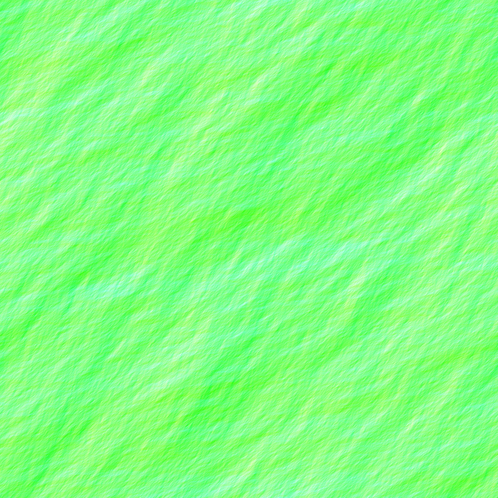
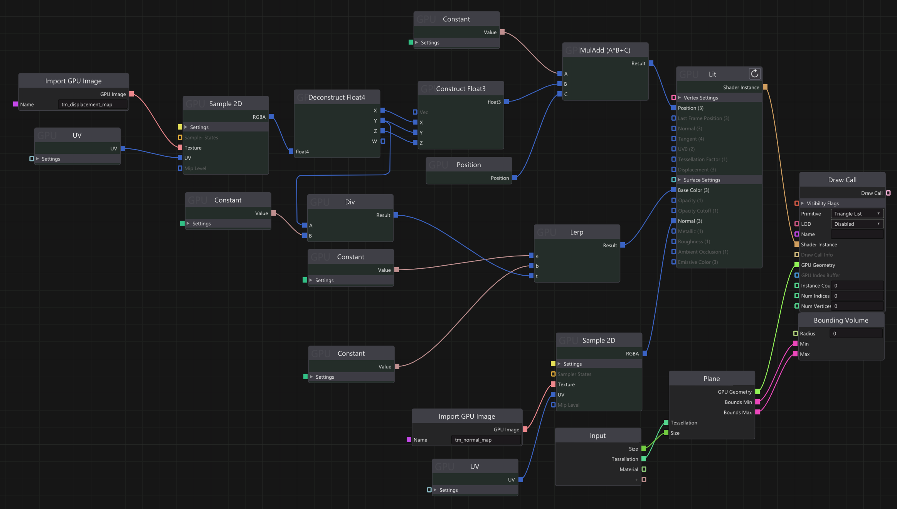

# Water Simulation in The Machinery
This project uses compute shaders to simulate ocean movement. 

It generates two images, a displacement map and a normal map. Visualized below:

 

Then the images are written to a blackboard to be used in The Machinery's creation graph:

The ocean simulation is then stepped forward in time and images are updated every frame.

# Video

